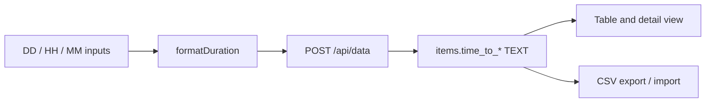

# TTA, TTR, and TTD

This document explains **Time to Detect (TTD)**, **Time to Acknowledge (TTA)**, and **Time to Recover (TTR)**—three incident-response metrics used in crisis and incident management—and how the Crisis Management Web App records and displays them.

These metrics apply to **Incident** and **Crisis** actions only. They are not used for Miscellaneous tasks.

---

## Incident lifecycle

The three metrics follow the natural order of incident response: something goes wrong, it is detected, the team acknowledges it, and service is recovered.

Exact start and end points for each interval are defined by your organization’s policy. The app stores the duration you record; it does not enforce a specific measurement rule.

---

## Metric definitions

### TTD — Time to Detect

| | |
|---|---|
| **Full name** | Time to Detect |
| **What it measures** | How long it took from when the incident began (or when it could reasonably have been detected) until it was identified—by monitoring, users, the service desk, or the operations team. |
| **Typical timeline** | **Start:** incident start or first point of failure. **End:** first awareness by the organization (alert, ticket, or confirmed report). |
| **Why it matters** | Long detection times often mean blind spots in monitoring, unclear ownership, or gaps in observability. Tracking TTD helps prioritize detection improvements. |

### TTA — Time to Acknowledge

| | |
|---|---|
| **Full name** | Time to Acknowledge |
| **What it measures** | How long it took from detection (or from incident start, depending on policy) until the responsible team formally acknowledged the incident and began active response. |
| **Typical timeline** | **Start:** detection or incident start (per your policy). **End:** acknowledgment—e.g. assignment, bridge opened, or status moved to “in progress.” |
| **Why it matters** | Acknowledgment is the handoff from “we know something is wrong” to “we are working on it.” Slow TTA can indicate staffing, escalation, or communication issues. |

### TTR — Time to Recover

| | |
|---|---|
| **Full name** | Time to Recover |
| **What it measures** | How long it took from incident start or acknowledgment until service or business functionality was restored to an acceptable level. |
| **Typical timeline** | **Start:** incident start or acknowledgment (per your policy). **End:** recovery—service restored, workaround in place, or crisis closed from an operational perspective. |
| **Why it matters** | TTR reflects operational impact duration. It is often distinct from full root-cause resolution, which may continue after recovery. |

> **Naming note:** This application uses **Time to Recover** for TTR. Some organizations use “Time to Resolve” for a similar concept. Here, TTR always means **Recover**, as shown in the UI and CSV column headers.

---

## How the Crisis Management Web App handles these metrics

### Manual entry (not auto-calculated)

TTA, TTR, and TTD are **not** computed from `Action Start Date`, `Start Time`, `Resolution Date`, `Resolution Time`, `End Date`, or `Closure Time`. Operators enter them explicitly.

**Resolution vs closure:** `Resolution Date` and `Resolution Time` are stored on the incident record (when the issue was fixed). `End Date` (Closure Date) and `Closure Time` are stored per crisis-meeting week when the action is closed in the meeting.

Unlike **Age**, which the app can calculate when creating a new action, these three fields depend on the values you provide at create or edit time.

### Input and storage

1. **Input:** Days (DD), hours (HH, 0–23), and minutes (MM, 0–59) in the Add Action form or the duration edit modal in the detail panel.
2. **Formatting:** The client builds a text string with non-zero parts as `Nd`, `Nh`, `Nm` (for example `2d 3h 15m`). If all parts are zero, the value is stored as **`N/A`**.
3. **Persistence:** Values are saved as **TEXT** on the `items` table in SQLite:

| Acronym | CSV / JSON field name | Database column |
|---------|----------------------|-----------------|
| TTA | `Time to Acknowledge` | `time_to_acknowledge` |
| TTR | `Time to Recover` | `time_to_recover` |
| TTD | `Time to Detect` | `time_to_detect` |

Column definitions live in `app.py` (`COLUMNS` and `CSV_TO_DB`). Older databases receive these columns via migration when the app starts.

### Where they appear in the UI

| Location | Description |
|----------|-------------|
| **Main table** | Columns 14–16 (headers **TTA**, **TTR**, **TTD**); visibility can be toggled |
| **Add Action modal** | Three duration groups: Time to Acknowledge (TTA), Time to Recover (TTR), Time to Detect (TTD) |
| **Detail panel** | Inline display and edit for each metric |
| **Sorting** | Table sort uses the full field names `Time to Acknowledge`, `Time to Recover`, `Time to Detect` |

### CSV import and export

Export includes the three columns with the exact headers above. Import stores whatever text is provided in those columns; the server does not parse or validate duration format on import.

---

## Data format reference

| Operator input (DD, HH, MM) | Stored and displayed value |
|------------------------------|----------------------------|
| All zero | `N/A` |
| 1 day, 2 hours, 30 minutes | `1d 2h 30m` |
| 45 minutes only | `45m` |
| CSV import | Stored as provided in the corresponding column |

When editing an existing value, the app parses strings matching `(\d+)d`, `(\d+)h`, and `(\d+)m` back into days, hours, and minutes for the edit modal.

---

## Practical guidance for operators

1. **Agree on definitions** — Before comparing incidents week to week, align with your team on what each metric’s start and end points are (especially whether TTA starts at detection or incident start, and whether TTR starts at start or acknowledgment).

2. **Record when you know the durations** — Fill in TTD, TTA, and TTR when you have reliable figures from tickets, bridges, or post-incident review. Leaving all parts at zero stores `N/A`, which is appropriate when the metric is unknown or not applicable.

3. **Use consistent units** — Prefer the in-app DD/HH/MM fields so values match the `Nd Nh Nm` format. If you import from CSV, use the same pattern (for example `3d 1h 0m` or `45m`) for consistency.

4. **CSV round-trip** — Export preserves the three columns. Re-importing a file with the same headers updates stored values without special handling.

5. **Weekly crisis meetings** — These fields support reporting on how quickly incidents were detected, acknowledged, and recovered. They complement status, owner, and dates but do not replace a full timeline in remarks or history.

---

## Current limitations

- **No automatic calculation** — The app does not derive TTA, TTR, or TTD from timestamps. Automatic calculation from start/end times would require new development.

- **No SLA or alerting** — There are no built-in thresholds, targets, or notifications based on these values.

- **Presentation summary** — The incident presentation summary narrative does not include TTA, TTR, or TTD today.

- **Limited server validation** — Duration format is enforced in the UI when using DD/HH/MM entry; CSV import accepts any text in the three columns.

- **Per action, not per week** — Values live on the `items` record and persist across weeks; they are not week-specific like `Action Status` in `week_status`.

---

## Related files in this repository

| File | Role |
|------|------|
| `app.py` | Column definitions, database mapping, API, CSV export/import |
| `index.html` | Forms, table columns, `formatDuration` / `parseDuration`, detail editing |
| `data/crisis_data.db` | SQLite storage (`time_to_acknowledge`, `time_to_recover`, `time_to_detect`) |
